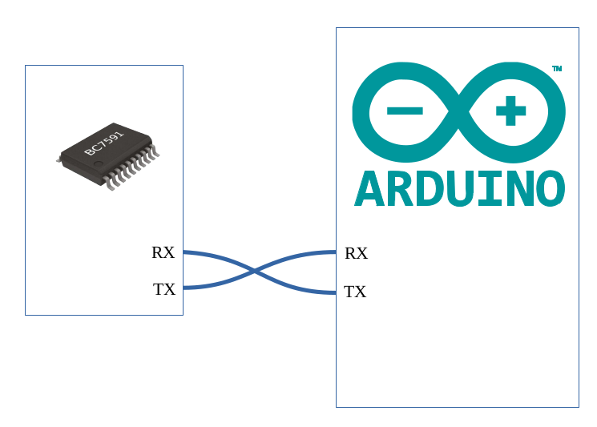

# BC759x 7seg LED Display Library For Arduino

## Overview

BC759x series 7-segment LED display driver + keyboard interface chip provides a unified UART single-line LED display interface, this driver library can be applied to the following chips:

- BC7595 -- 48 segments (six 7-segment numeric displays with decimal points) + 48-key keyboard matrix chip, datasheets: (English , [简体中文](./extras/docs/bc7595.pdf))

- BC7591 -- 256 segments (32 7-segment numeric displays with decimal points) + 96-key keyboard matrix chip, datasheets: ([English](./extras/docs/bc7591_en.pdf_) , [简体中文](./extras/docs/bc7591.pdf))

This driver library is compatible with all Arduino devices, and can be used with both hardware serial ports and software serial ports.
Each instruction of the BC759x consists of 2 bytes, the first byte is the instruction and the second byte is the data. The driver library provides a basic function, sendCmd(), which can be used to send arbitrary instructions to the BC759x. At the same time, the driver library provides several upper-layer functions that wrap several of the most commonly used functions in use. The upper-layer functions are as follows.

- clear() - Clear display content and blink status

- displayDec() - Display values in decimal

- displayHex() - Display values in hexadecimal

- displayFloat() - Display float point values

- digitBlink() - Digitwise blink control

For those functions that can be done with a single BC759x instruction, although they are frequently used - such as individual LED on/off control - are not implemented as upper-level functions, as this does not simplify their use for the user.
For detailed information about the instructions of the BC759x chip, please refer to the datasheets of the corresponding chip.

## Library Installation

The driver library is very easy to install, just search the name of the library or the chip number in the Arduino Library Manager. 
Or if you prefer to download the zip file and start from there: In the Arduino IDE menu, select "Sketch --> Include Library --> Add .ZIP Library..." 
Select "uart_7seg_display.zip", then it's done.
After installation, you will see the UART_7Seg_Display library in the "Skech --> Include Library" menu, which means it is ready to use.

## Hardware Connection

The BC759x chip uses serial communication, and the communication uses 2 pins TX and RX, where TX on chip is the output of the keyboard interface of the BC759x, and the display driver actually uses the on chip RX pin only. If you use the display function of the BC759x only(without using its keyboard interface), the only pin you need to connect is the RX plus the power supply. As the display and keyboard are usually used together in most cases, both RX and TX will be connected. To connect, the TX/RX pins on the chip are cross-linked to the RX/TX pins of the Arduino's serial port.

For more detailed information about this library please see : [usage](./extras/docs/usage.md)

Or for the PDF version of the complete user manual in [简体中文](./extras/docs/BC759x_7seg_LED_Display_Library_Arduino_cn.pdf) or [English](./extras/docs/BC759x_7seg_LED_Display_Library_Arduino.pdf)
